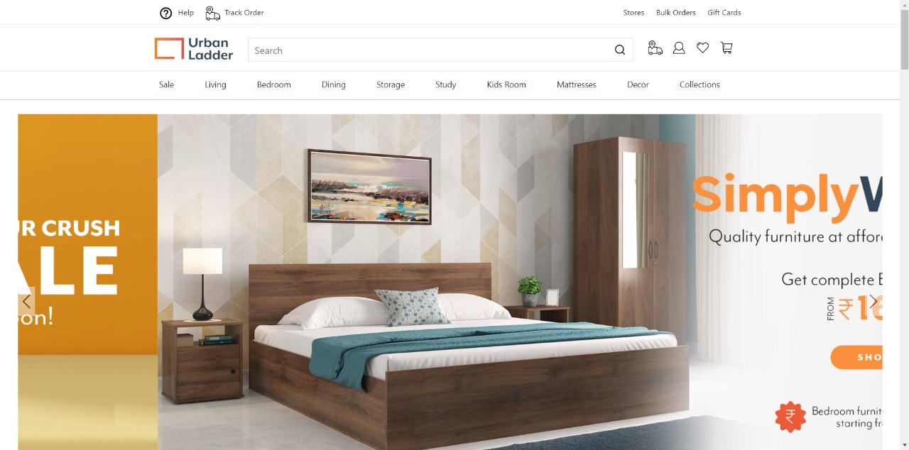
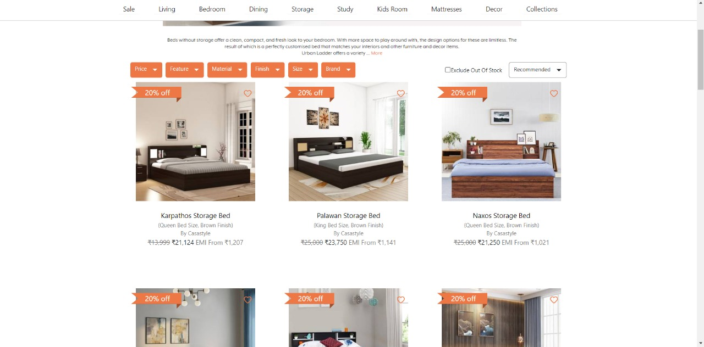
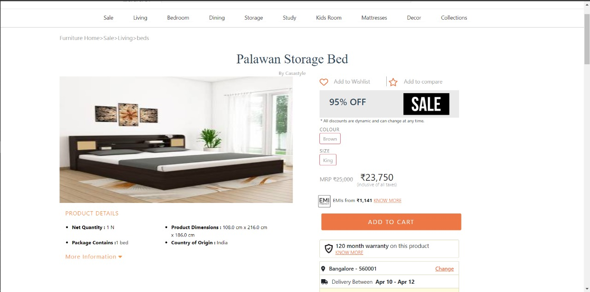
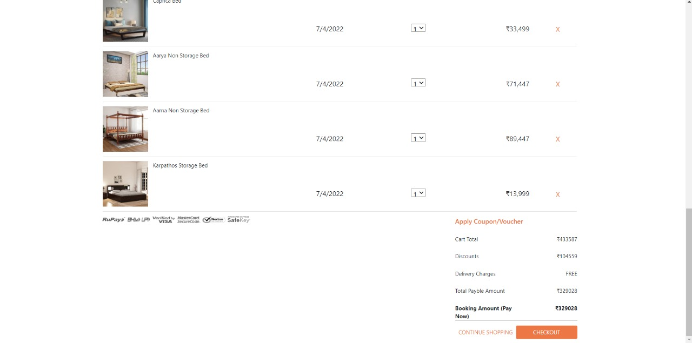
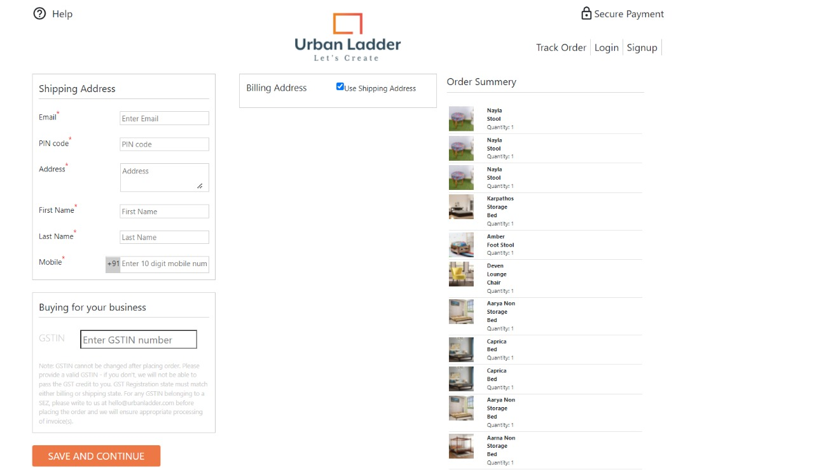

# Urban Ladder CLONE
<h3>About website</h3>
Urban Ladder, an online furniture store, is home to exceptional furniture options for every part of your home including the bedroom, living room and kitchen. 

<ol >
<li>
 <h3>Landing Page</h3> 

</li>
<li>
<h3>SignUp Page</h3> 

</li>
<li>
<h3>Product-list</h3> 

</li>
<li>
<h3>Product-Details</h3> 

</li>
  <li>
<h3>Cart And Checkout</h3> 

</li>
 <li>
<h3>Shipping-Address</h3> 

</li>

</ol>

## Technologies used :-
1) React
2) Redux
3) Context API
4) NodeJs
5) Express
6) MongoDB
7) Material UI
8) Module-CSS
9) Ant Design

## Contributions:-

### Raja  [GitHub](https://github.com/rajachoudhary) - [LinkedIn](https://www.linkedin.com/in/raja-ch01/)

### Muskan  [GitHub](https://github.com/MuskanIss) - [LinkedIn](https://www.linkedin.com/in/muskan-issrani-058793191/)

### Shanu [Github](https://github.com/Shanu30) - [LinkedIn](https://www.linkedin.com/in/kumar-shanu-a73636140)

### Utkarsh [Github](https://github.com/utkrsh2505) - [LinkedIn](https://www.linkedin.com/in/utkarsh-kumar-840a23190/)

